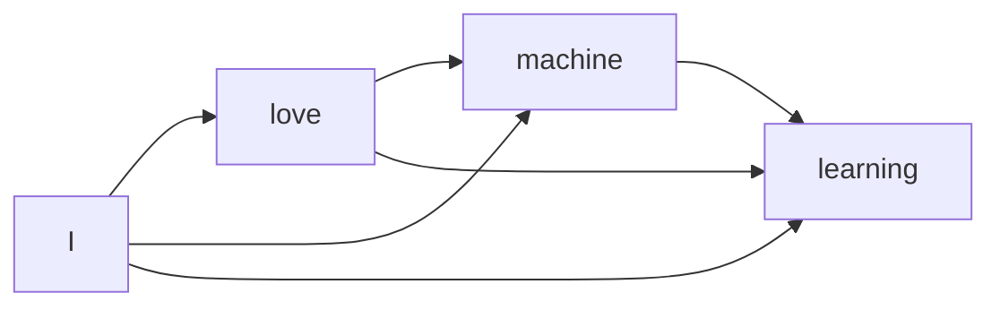

# GPT Architecture — Part 2I Supplement: KV Cache Deep Dive

> This note is a practical, interactive-style deep dive into KV cache.
> It is written in GitHub-safe Markdown: formulas are kept in readable text blocks to avoid rendering issues.

---

## Table of Contents

1. [What You Should Understand After This Note](#1-what-you-should-understand-after-this-note)
2. [The Core Problem](#2-the-core-problem)
3. [Quick Reminder: Q, K, and V](#3-quick-reminder-q-k-and-v)
4. [Without KV Cache](#4-without-kv-cache)
5. [With KV Cache](#5-with-kv-cache)
6. [Prefill vs Decode](#6-prefill-vs-decode)
7. [Why We Cache K and V, Not Q](#7-why-we-cache-k-and-v-not-q)
8. [Your Important Doubt: Do Old Tokens Change?](#8-your-important-doubt-do-old-tokens-change)
9. [Causal Mask Makes KV Cache Valid](#9-causal-mask-makes-kv-cache-valid)
10. [What Happens Inside One GPT Layer During Decode](#10-what-happens-inside-one-gpt-layer-during-decode)
11. [KV Cache Shape](#11-kv-cache-shape)
12. [KV Cache Memory Formula](#12-kv-cache-memory-formula)
13. [Worked Example](#13-worked-example)
14. [Practice: Calculate It Yourself](#14-practice-calculate-it-yourself)
15. [Attention Compute vs KV Cache Memory](#15-attention-compute-vs-kv-cache-memory)
16. [Batch Size and Long Context](#16-batch-size-and-long-context)
17. [GQA and MQA](#17-gqa-and-mqa)
18. [Common Confusions](#18-common-confusions)
19. [Interview-Level Answer](#19-interview-level-answer)
20. [Final Memory Hooks](#20-final-memory-hooks)

---

## 1. What You Should Understand After This Note

By the end, you should be able to answer:

- [ ] What is KV cache?
- [ ] Why does GPT use KV cache during inference?
- [ ] Why do we cache K and V but not Q?
- [ ] Why do old K and V not need to be updated after a new token is generated?
- [ ] How do prefill and decode differ?
- [ ] How do we calculate KV cache memory?
- [ ] Why does KV cache make inference faster but use more memory?

Main idea:

```text
KV cache stores previous tokens' Key and Value vectors during GPT inference.
This avoids recomputing old K and V again and again while generating new tokens.
```

Memory hook:

```text
KV cache trades memory for speed.
```

---

## 2. The Core Problem

GPT generates text one token at a time.

Example:

```text
Prompt:
I love machine

GPT predicts:
learning

Now context becomes:
I love machine learning

GPT predicts next:
because
```

At every generation step, the new token must look back at the previous context.

The inefficient way would be:

```text
Every time a new token is generated,
recompute attention information for all previous tokens again.
```

That is wasteful because previous tokens have already been processed.

---

## 3. Quick Reminder: Q, K, and V

Inside self-attention, every token creates three vectors:

| Vector | Full form | Simple meaning |
|---|---|---|
| `Q` | Query | What this token is looking for |
| `K` | Key | What this token offers for matching |
| `V` | Value | What information this token provides |

Search analogy:

```text
Q = search query
K = searchable label / index
V = actual content returned
```

For a new token during generation:

```text
new Q searches old K

attention weights select old V
```

So the new token needs access to previous tokens' K and V.

---

## 4. Without KV Cache

Suppose GPT has already processed:

```text
I love machine
```

It has computed K and V for:

```text
I
love
machine
```

Then GPT generates:

```text
learning
```

Now the context is:

```text
I love machine learning
```

Without KV cache, GPT recomputes K and V for the full context again:

```text
I
love
machine
learning
```

That means K and V for `I`, `love`, and `machine` are recomputed again.

### Visualization: recomputation without KV cache

```text
Step 1 context:
[I] [love] [machine]
 |    |       |
K,V  K,V     K,V

Step 2 context after generating learning:
[I] [love] [machine] [learning]
 |    |       |          |
K,V  K,V     K,V        K,V

Problem:
K,V for I, love, and machine were already computed,
but they are computed again.
```

<details>
<summary>Checkpoint 1: What is the waste here?</summary>

The waste is recomputing K and V for old tokens again and again.

After `I`, `love`, and `machine` are processed once, their K and V do not need to be recomputed during GPT decoding.

</details>

---

## 5. With KV Cache

With KV cache, GPT stores old K and V.

After processing:

```text
I love machine
```

the cache stores:

```text
K cache: [K_I, K_love, K_machine]
V cache: [V_I, V_love, V_machine]
```

When GPT generates:

```text
learning
```

it computes only:

```text
K_learning
V_learning
```

Then it appends them to the cache:

```text
K cache: [K_I, K_love, K_machine, K_learning]
V cache: [V_I, V_love, V_machine, V_learning]
```

### Visualization: cache reuse

```text
Before new token:
K cache: [K_I, K_love, K_machine]
V cache: [V_I, V_love, V_machine]

New token:
learning

Compute only:
K_learning, V_learning

After appending:
K cache: [K_I, K_love, K_machine, K_learning]
V cache: [V_I, V_love, V_machine, V_learning]
```

Memory hook:

```text
Old tokens provide cached K and V.
The new token adds new K and V.
```

---

## 6. Prefill vs Decode

LLM inference has two phases:

```text
1. Prefill
2. Decode
```

### 6.1 Prefill

Prefill processes the original prompt.

Example:

```text
Prompt:
I love machine learning
```

During prefill:

```text
all prompt tokens are processed together
K and V are computed for all prompt tokens
KV cache is created
```

Visualization:

```text
Prompt tokens:
[I] [love] [machine] [learning]

Prefill computes:
K_I, K_love, K_machine, K_learning
V_I, V_love, V_machine, V_learning

KV cache is now filled.
```

### 6.2 Decode

Decode generates one token at a time.

At each decode step:

```text
1. Compute Q for the new token.
2. Compute K and V for the new token.
3. Reuse old K and V from cache.
4. New Q attends over cached K.
5. Attention weights select information from cached V.
6. Append new K and V to cache.
```

Memory hook:

```text
Prefill builds the cache.
Decode reuses and grows the cache.
```

### Mermaid: prefill and decode


---

## 7. Why We Cache K and V, Not Q

A common question:

```text
Why is it called KV cache and not QKV cache?
```

Reason:

```text
At each generation step, only the newest token needs a fresh query.
```

For the new token:

```text
Q_new = what the new token is looking for
```

Then `Q_new` searches over old keys:

```text
K_old_tokens
```

and retrieves information from old values:

```text
V_old_tokens
```

Old queries are not needed again for predicting the next token.

### Tiny example

Current context:

```text
I love machine learning
```

New token being processed:

```text
because
```

The model needs:

```text
Q_because

K_I, K_love, K_machine, K_learning, K_because

V_I, V_love, V_machine, V_learning, V_because
```

It does not need:

```text
Q_I, Q_love, Q_machine, Q_learning
```

for the current next-token prediction.

<details>
<summary>Checkpoint 2: Why does the new token need old K and V?</summary>

The new token's query uses old keys to decide which previous tokens are relevant.
Then it uses old values to pull useful information from those previous tokens.

In simple words:

```text
Q decides where to look.
K helps with matching.
V carries the information.
```

</details>

---

## 8. Your Important Doubt: Do Old Tokens Change?

This was the most important doubt:

```text
When a new token is generated, don't the relationships between previous tokens change?
If yes, shouldn't we update old K and V again?
```

This doubt is very natural.

For humans, when a new word appears, we may reinterpret the older words.

Example:

```text
I love machine
```

After seeing:

```text
learning
```

we understand that `machine` is part of the phrase `machine learning`.

So it feels like the earlier token `machine` should change.

But GPT generation does not work like a bidirectional human rereading process.

GPT uses causal attention.

---

## 9. Causal Mask Makes KV Cache Valid

In GPT:

```text
Token t can attend only to tokens 1 through t.
```

Example:

```text
I love machine learning
```

Allowed attention:

```text
I        -> I

love     -> I, love

machine  -> I, love, machine

learning -> I, love, machine, learning
```

Notice carefully:

```text
machine cannot attend to learning.
```

Even after `learning` exists, the token `machine` does not look forward.

Therefore, the representation of `machine` does not depend on `learning`.

That means:

```text
K_machine and V_machine do not need to change.
```

### Mermaid: causal direction



This diagram means:

```text
Past tokens can influence future tokens.
Future tokens cannot influence past tokens.
```

### If we recomputed everything

Suppose GPT first processed:

```text
I love machine
```

Then it generated:

```text
learning
```

If we recomputed the whole sequence:

```text
I love machine learning
```

because of causal masking, old token representations would remain the same:

```text
I        -> same as before
love     -> same as before
machine  -> same as before
learning -> new
```

So recomputing old K and V would give the same result again.

That is wasted compute.

<details>
<summary>Checkpoint 3: Why does causal masking make old K and V reusable?</summary>

Because old tokens cannot attend to new future tokens.

So the representation of an old token depends only on tokens before it and itself.

When a new token is added on the right, old token representations remain unchanged.

Since K and V are created from those representations, old K and V remain valid.

</details>

---

## 10. What Happens Inside One GPT Layer During Decode

For one new token in one GPT layer:

```text
new token hidden state
  ↓
create Q_new, K_new, V_new
  ↓
append K_new and V_new to this layer's KV cache
  ↓
Q_new attends to all cached K
  ↓
attention weights are created
  ↓
attention weights are multiplied with cached V
  ↓
attention output goes through output projection
  ↓
attention output goes to FFN
  ↓
result moves to next GPT layer
```

Important:

```text
Each GPT layer has its own KV cache.
```

So if the model has 32 layers, there are 32 separate KV caches.

### Layer-wise cache picture

```text
Layer 1 cache:
K_1 for all cached tokens
V_1 for all cached tokens

Layer 2 cache:
K_2 for all cached tokens
V_2 for all cached tokens

...

Layer 32 cache:
K_32 for all cached tokens
V_32 for all cached tokens
```

The K and V vectors are different at different layers because each layer has different hidden representations and different projection weights.

---

## 11. KV Cache Shape

For one layer, KV cache stores K and V.

K cache shape:

```text
B × H_kv × T × D
```

V cache shape:

```text
B × H_kv × T × D
```

where:

| Symbol | Meaning |
|---|---|
| `B` | Batch size |
| `H_kv` | Number of key/value heads |
| `T` | Number of cached tokens |
| `D` | Head dimension |

For standard multi-head attention:

```text
H_kv = H
```

So one layer stores:

```text
K values = B × H × T × D
V values = B × H × T × D
```

Because both K and V are stored:

```text
KV cache values per layer = 2 × B × H × T × D
```

Since:

```text
H × D = d_model
```

for standard multi-head attention:

```text
KV cache values per layer = 2 × B × T × d_model
```

---

## 12. KV Cache Memory Formula

For `L` layers:

```text
KV cache values = 2 × L × B × H × T × D
```

For standard multi-head attention, since `H × D = d_model`:

```text
KV cache values = 2 × L × B × T × d_model
```

If each value takes `s` bytes:

```text
KV cache memory = 2 × L × B × T × d_model × s
```

Where:

| Term | Meaning |
|---|---|
| `2` | K and V are both stored |
| `L` | Number of layers |
| `B` | Batch size |
| `T` | Number of cached tokens |
| `d_model` | Hidden dimension |
| `s` | Bytes per stored value |

For FP16 or BF16:

```text
s = 2 bytes
```

So:

```text
KV cache memory = 4 × L × B × T × d_model bytes
```

---

## 13. Worked Example

Suppose:

```text
L = 32 layers
B = 1
T = 4096 tokens
d_model = 4096
s = 2 bytes for FP16
```

Formula:

```text
M_KV = 2 × L × B × T × d_model × s
```

Substitute:

```text
M_KV = 2 × 32 × 1 × 4096 × 4096 × 2 bytes
```

First calculate stored values:

```text
2 × 32 × 1 × 4096 × 4096 = 1,073,741,824 values
```

Each value is 2 bytes:

```text
1,073,741,824 × 2 bytes = 2,147,483,648 bytes
```

Approximate decimal GB:

```text
2,147,483,648 bytes ≈ 2.15 GB
```

Approximate binary GiB:

```text
2,147,483,648 bytes = 2.00 GiB
```

So the KV cache alone is about:

```text
2.15 GB, or 2.00 GiB
```

for one request with 4096 cached tokens.

<details>
<summary>Why GB and GiB are slightly different</summary>

Decimal GB uses powers of 1000:

```text
1 GB = 1,000,000,000 bytes
```

Binary GiB uses powers of 1024:

```text
1 GiB = 1,073,741,824 bytes
```

So:

```text
2,147,483,648 bytes = 2.15 GB = 2.00 GiB
```

</details>

---

## 14. Practice: Calculate It Yourself

### Practice 1

Given:

```text
L = 24
B = 1
T = 2048
d_model = 2048
s = 2 bytes
```

Find:

```text
M_KV = ?
```

<details>
<summary>Show answer</summary>

Formula:

```text
M_KV = 2 × L × B × T × d_model × s
```

Substitute:

```text
M_KV = 2 × 24 × 1 × 2048 × 2048 × 2 bytes
```

Values:

```text
2 × 24 × 1 × 2048 × 2048 = 201,326,592 values
```

Bytes:

```text
201,326,592 × 2 = 402,653,184 bytes
```

Approximate:

```text
402,653,184 bytes ≈ 0.40 GB ≈ 0.375 GiB
```

</details>

### Practice 2

Given:

```text
L = 32
B = 8
T = 4096
d_model = 4096
s = 2 bytes
```

Find:

```text
M_KV = ?
```

<details>
<summary>Show answer</summary>

This is the same as the earlier example, but with batch size 8.

For batch size 1:

```text
M_KV ≈ 2.15 GB
```

For batch size 8:

```text
M_KV ≈ 2.15 × 8 = 17.2 GB
```

Exact bytes:

```text
2 × 32 × 8 × 4096 × 4096 × 2 = 17,179,869,184 bytes
```

Approximate:

```text
17.18 GB = 16.00 GiB
```

</details>

### Practice 3

Given:

```text
L = 32
B = 1
T = 8192
d_model = 4096
s = 2 bytes
```

How does this compare to the 4096-token example?

<details>
<summary>Show answer</summary>

Only `T` doubled:

```text
4096 -> 8192
```

KV cache memory grows linearly with `T`.

So memory doubles:

```text
2.15 GB -> 4.30 GB
```

Exact bytes:

```text
2 × 32 × 1 × 8192 × 4096 × 2 = 4,294,967,296 bytes
```

Approximate:

```text
4.30 GB = 4.00 GiB
```

</details>

---

## 15. Attention Compute vs KV Cache Memory

Do not confuse these two things.

| Quantity | Grows with context length as | Meaning |
|---|---:|---|
| Attention matrix compute | `T²` | New tokens compare against many previous tokens |
| KV cache memory | `T` | Store K and V for each cached token |

If context length doubles:

```text
T -> 2T
```

Then:

```text
Attention matrix compute -> 4x
KV cache memory -> 2x
```

Memory hook:

```text
Attention compute suffers from T².
KV cache memory suffers from T.
```

---

## 16. Batch Size and Long Context

KV cache memory grows linearly with batch size.

If one request needs:

```text
2.15 GB
```

then eight requests in the same batch need:

```text
2.15 GB × 8 = 17.2 GB
```

So production systems must balance:

```text
larger batch size -> better throughput
larger batch size -> more KV cache memory
```

Long context also increases KV cache memory:

```text
more tokens -> more cached K and V -> more memory
```

This is why LLM systems often limit:

```text
maximum context length
maximum generated tokens
batch size
number of simultaneous requests
```

---

## 17. GQA and MQA

In standard multi-head attention:

```text
number of query heads = number of key/value heads
```

So if the model has 32 query heads, it may also store K and V for 32 heads.

Modern LLMs may use:

```text
GQA = Grouped-Query Attention
MQA = Multi-Query Attention
```

### GQA

In GQA:

```text
many query heads share fewer key/value heads
```

Example:

```text
32 query heads
8 key/value heads
```

This reduces KV cache memory because fewer K and V heads are stored.

### MQA

In MQA:

```text
many query heads share one key/value head
```

Example:

```text
32 query heads
1 key/value head
```

This reduces KV cache memory even more.

Memory hook:

```text
GQA and MQA reduce KV cache by reducing key/value heads.
```

### Important formula note

For standard MHA:

```text
KV cache values = 2 × L × B × H × T × D
```

For GQA/MQA:

```text
KV cache values = 2 × L × B × H_kv × T × D
```

where:

```text
H_kv = number of key/value heads
```

If `H_kv` is smaller than `H`, KV cache becomes smaller.

---

## 18. Common Confusions

### Q1. Does KV cache reduce memory?

No.

KV cache increases memory usage.

It reduces repeated computation.

Memory hook:

```text
KV cache saves compute but spends memory.
```

---

### Q2. Does KV cache remove all attention cost?

No.

Even with KV cache, the new token still attends to cached previous tokens.

So GPT still computes:

```text
Q_new against cached K
attention weights times cached V
```

Long context still costs more.

---

### Q3. Is KV cache used during training?

Usually, no.

During training, GPT processes full sequences in parallel using a causal mask.

KV cache is mainly an inference-time optimization for autoregressive decoding.

---

### Q4. Does each layer have its own KV cache?

Yes.

Each layer produces different K and V representations, so each layer needs its own cache.

---

### Q5. Why do old K and V remain valid?

Because GPT is causal.

Old tokens cannot attend to future tokens.

So old token representations do not change when new tokens are generated.

---

### Q6. Would old tokens change in BERT?

Yes.

BERT is bidirectional, so previous tokens can attend to future tokens.

GPT is decoder-only and causal, so previous tokens do not depend on future tokens.

---

## 19. Interview-Level Answer

If an interviewer asks:

```text
What is KV cache and why is it used in GPT inference?
```

You can answer:

KV cache is an inference-time optimization used in autoregressive decoder-only models like GPT. During generation, every new token attends to previous tokens. The keys and values for previous tokens do not change because GPT uses causal self-attention, where old tokens cannot attend to future tokens. Therefore, we can store previous keys and values for each layer and reuse them instead of recomputing them at every decoding step.

At each new decode step, the model computes the new token's query, key, and value, appends the new key and value to the cache, and uses the new query to attend over all cached keys and values. This speeds up decoding but increases memory usage. For standard multi-head attention, KV cache memory is roughly:

```text
M_KV = 2 × L × B × T × d_model × s
```

where `L` is number of layers, `B` is batch size, `T` is cached sequence length, `d_model` is hidden dimension, and `s` is bytes per stored value.

---

## 20. Final Memory Hooks

```text
KV cache = stored keys and values from previous tokens.

New token brings a new Q.

Old tokens provide cached K and V.

GPT is causal, so old tokens do not depend on new tokens.

Therefore old K and V remain valid.

Prefill builds the cache.

Decode reuses and grows the cache.

Each GPT layer has its own KV cache.

KV cache speeds up inference but uses memory.

Standard MHA KV cache memory:
M_KV = 2 × L × B × T × d_model × s

GQA/MQA KV cache memory:
M_KV = 2 × L × B × H_kv × T × D × s

KV cache grows linearly with context length.

Attention matrix compute grows quadratically with context length.

GQA and MQA reduce KV cache by reducing key/value heads.
```

---

## 21. Final One-Line Summary

```text
KV cache stores previous tokens' keys and values during GPT inference, making decoding faster by avoiding repeated K/V computation, while increasing memory usage linearly with layers, batch size, context length, and hidden dimension.
```
